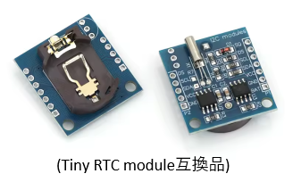

ー　工事中　（Under construction）ー

# MEZ68K8_RAM Rev2.1 for FUZIX 0.5

MEZ68K8_RAM Rev2.1は[EMUZ80](https://vintagechips.wordpress.com/2022/03/05/emuz80_reference/)ボード上で動く68008メザニンボードです。

（MEZ68K8_RAM Rev2.1メザニンボード）
 

EMUZ80はMicrochip社のPIC18F47Q43/83/84を使用して、Z80を制御するシングルボードコンピュータ
です。また、Z80の代わりにメザニンボードを装着することで、レガシーCPU（6502や、8088、V20、他）
を動かすことが出来ます。 
UART, SPI, I2C等の制御をPICで行い、レガシーCPUの外部I/Oとして機能を提供します。
SDカードはSPIを通して実装されています。 
PICから、レガシーCPUのメモリ空間にアクセスすることで、レガシーPCのプログラムをロードする
ことが出来るため、ROMは必要なくSRAMでプログラムを動作させることが出来ます。

（EMUZ80、MEZ68K8_RAM、RTCモジュール、SDカードモジュール）
 

MEZ68K8_RAM Rev2.1の[FUZIX](https://www.fuzix.org/)は、platform-[pico68k](https://hackaday.io/project/179200-68000-minimal-homebrew-computer)をベースにポーティングを行いました。

リアルタイムクロックは、platfoem-[68knano](https://github.com/74hc595/68k-nano)のds3234デバイスの実装を参考にしています。
# FUZIX起動画面
 

MEZ68K8_RAM Rev2.1では、FUZIX以外に、CP/M-68Kや68000用の[Universal Monitor](https://electrelic.com/electrelic/node/1317)をサポートしていますが、詳細については、[MEZ68K8_RAM(Rev1.3)](https://github.com/akih-san/MEZ68K8_RAM)を参照してください。

# [MEZ68K8_RAM(Rev1.3)](https://github.com/akih-san/MEZ68K8_RAM)からの追加変更点

１．IRQ, NMI割り込みのサポート 
２．RTC(DS1307)のサポート 
３．グルー・ロジック

## １．IRQ, NMI割り込みのサポート
Rev1.3では割り込みなく、最小限の機能を実現していました。Rev2.1では、オートベクターによるレベル５(IRQ)とレベル７(NMI)の割り込みをサポートします。 
10msインターバルのＩＲＱ割り込みを発生させています。UARTによるキー入力は、この割り込みでCPUに取り込まれ、バッファリングされます。 
CTRL-Qのキー入力でNMI割り込みが発生します。FUZIX動作時には、NMI割り込みでモニタ（Universal Monitor）が起動します。 
ただし、CP/M-68KはIRQ、NMI割り込みを使っていません。（Rev1.3相当のCP/M-68K） 
その他のプログラムではNMI割り込みの表示が出ますが、何もしないで元のプログラムに復帰します。 
 
## ２．RTC(DS1307)のサポート
I2Cを実装し、DS1307を使ったTiny RTC moduleをサポートします。 
Tiny RTC moduleはArduinoで使用可能で、[AliExpress](https://ja.aliexpress.com/?spm=a2g0o.home.logo.1.2fc55c72FX1lyE)から入手
することができます。また、安価な互換品が出回っています。テストでは互換品を使いましたが、特に問題なく使用できました。
SQピン端子は未使用です。SCL、SDA、VCC、GNDの４ピンを使用しています。

## ３．グルー・ロジック
SDカードアクセスの一部、割り込み、メモリアクセス関連の外部ロジックをCPLD（ATF16V8B）を使用して1chipにまとめてあります。
使用するために、jedファイルをATF16V8Bに書き込む必要があります。

# ファームウェアの書き込み
## 1. PIC18F47Q43/Q84/Q83
PICへの書き込みツールを用いて、ヘキサファイルを書き込みます。 
 
- PIC18F47Q43 - Q43Rev2.1.hex
- PIC18F47Q84 - Q84Rev2.1.hex
- PIC18F47Q83 - Q83Rev2.1.hex
 
＜注意点＞ 
EMUZ80ボードから、メザニンボード（MEZ68K8_RAM Rev2.1）を外した状態でPICへの書き込みを行います。
メザニンボードを装着しての書き込みは、かなりの高確率で失敗します。もしくは、PICに書き込めるライターを使用し、直接PICへ書き込みを行います。 
 
＜使用確認した書き込みツール＞ 
 
- snap(マイクロチップ社の書き込みツール) 

  - [snap](https://www.microchip.com/en-us/development-tool/PG164100)

 
- PICkit3（または互換ツール）  
  PICkitminus書き込みソフトを用いて、書き込むことが出来ます。以下で入手できます。 

  - [PICkitminus](http://kair.us/projects/pickitminus/)

## ２．CPLDへの書き込み

   CPLDには、ROMライタを使用してG16V8B/MEZ68K8_RAM2.1.jedファイルを書込みます。 
   使用したのは、XGecu Programmer Model TL866Ⅱ PLUSです。 
   少し古いですが、問題なく書き込みが出来ました。XGecu Official Siteは[こちら](https://xgecu.myshopify.com/) 

    
（今回使用したROMライタ）

## ３．μＳＤカードの作成
μSDカードはFAT32を使用しています。4G～16GBまでのＳＤカードで動作確認を行いました。DISKSフォルダ内の以下のフォルダとファイルを、FAT32でフォーマットされた
μSDカードにコピーします。 
 
　・CPMDISKS（CP/M-68K関連のフォルダ） 
　・OSDISKS	（FUZIX関連のフォルダ） 

　　（注意）フォルダ内に、圧縮されたDISK.zipファイルがあります。 
　　　　　　Gitのファイル容量制限でFUZIXのディスクイメージファイルを圧縮してあります。 
　　　　　　解凍したDISK.IMGファイルをコピーします。 

　・BASIC68K.BIN	（スタンドアロン版BASIC） 
　・UMON_68K.BIN	（ユニバーサルモニタ）

# 図面、部品表、PICピンアサイン、Gerberデータ
  - [図面](https://github.com/akih-san/FUZIX-for-MEZ68K8_RAM-Rev2.1/blob/main/pdf/MEZ68K8_RAM_R2.1%E5%9B%B3%E9%9D%A2.pdf)
  - [部品表](https://github.com/akih-san/FUZIX-for-MEZ68K8_RAM-Rev2.1/blob/main/pdf/MEZ68K8_RAM_R2.1%E9%83%A8%E5%93%81%E8%A1%A8.pdf)
  - [PICピンアサイン](https://github.com/akih-san/FUZIX-for-MEZ68K8_RAM-Rev2.1/blob/main/pdf/MEZ68K8_RAM%20v2.1%EF%BC%88PIC%E3%83%94%E3%83%B3%E3%82%A2%E3%82%B5%E3%82%A4%E3%83%B3%EF%BC%89.pdf)
  - [Gerberデータ](https://github.com/akih-san/FUZIX-for-MEZ68K8_RAM-Rev2.1/tree/main/MEZ68K8_RAM_R2.1_gerber)

# ソースコードからFUZIX 05をビルドする
[FUZIX](https://www.fuzix.org/)の移植をLinuxで行います。Windows10/11であれば、WSLを使えば問題なく移植できる？のではないでしょうか。
私の場合は、raspberrypi 5を開発環境として使用しました。

## 1. m68k-elf-gcc
68000版の移植にはm68k-elf-gccが必要です。私は[ここ](https://github.com/andwn/marsdev/releases)から入手しました。 
GitHubからクローンして：
 - `git clone https://github.com/andwn/marsdev`
 - `cd marsdev`

makeに、いくつかパッケージが必要となりますので、無ければインストールする必要があります。 
　`ubuntu: build-essential texinfo wget` 
 - `apt install build-essential texinfo wget` 
 - `make m68k-toolchain` 
　　（PCのCPUパワーに依存しますが、makeに少々時間がかかります。） 
 - `sudo make install` 
　　デフォルトだと/opt/toolchains/marsにm68k-elf-gccの環境が作られます。 
　　PATHを通せば、使用可能となります。.bashrc等に設定すればOK 
 - `export PATH="$PATH:/opt/toolchains/mars/m68k-elf/bin"` 
 
以下のようにバージョンが表示されればＯＫ 
> m68k-elf-gcc --version 
m68k-elf-gcc (GCC) 14.2.0 
Copyright (C) 2024 Free Software Foundation, Inc. 
This is free software; see the source for copying conditions.  There is NO 
warranty; not even for MERCHANTABILITY or FITNESS FOR A PARTICULAR PURPOSE. 
> 
 
（日本語ファイルREADME-ja.mdがありますので、参照してください） 

## 2. FUZIX 0.5をgit
[FUZIXをビルドしてみよう【0.4版】](https://cwaweb.bai.ne.jp/~ohishi/zakki/buildFUZIX.htm)を参考にしました。分かりやすく解説されています。 
ビルドに必要なパッケージも解説されていますので、足りないものはインストールが必要です。 
　・`GCC (C/C++)` 
　・`byacc` 
　・`flex` 
　・`boost-devel (libboost-dev)` 
　・`makeinfo (texinfo)` 
　・`git` 
　・`zlib (zlib1g-dev)` 
　　　byaccについては次の後処理が必要とのこと。 
　・`sudo update-alternatives --set yacc /usr/bin/byacc` 
 
準備ができたら、FUZIXをgitします。 
 - `git clone https://github.com/EtchedPixels/FUZIX.git` 
 

## 3. platformにmez68k-ramを追加する
(カレントディレクトリにFUZIXとFUZIX-for-MEZ68K8_RAM-Rev2.1をgitしていると仮定しています。） 
FUZIX/Kernrl/platformフォルダの下にplatform-mez68k-ramフォルダをコピーします。 
 - `cp -r ~/FUZIX-for-MEZ68K8_RAM-Rev2.1/platform-mez68k-ram ~/FUZIX/Kernrl/platform` 
 

## 4. Makefileを編集し、mez68k-ramを指定する
次に、~/FUZIX/Makefileを編集し、ターゲットにmez68k-ramを指定します。 
 - `TARGET ?= zrc　　-->  TARGET ?= mez68k-ram` 

## 5. FUZIXフォルダ下でMakeする
 - `$ cd FUZIX 
 - `~/FUZIX$ make`　　（少々時間がかかります。） 
 - `~/FUZIX$ make diskimage` 

## 6. 作成されるファイル
 - FUZIX/Images/mez68k-ramフォルダの下に、DISK.IMG 
 - FUZIX/Kernelフォルダの下に、FUZIX.BIN 
 - FUZIX/Kernrl/platform/platform-mez68k-ramフォルダの下に、MON.BIN 

# その他のツール
・FWのソースのコンパイルは、マイクロチップ社の「MPLAB® X Integrated Development Environment (IDE)」を使っています。 
　[MPLAB X IDE v6.25](https://www.microchip.com/en-us/tools-resources/develop/mplab-x-ide) 
　コンパイラは、XC8を使用しています。 
 
・universal moniter 68000、及びEnhanced 68k BASICは、 
　[Macro Assembler AS V1.42](http://john.ccac.rwth-aachen.de:8000/as/) 
を使用してバイナリを作成しています。 
 
・FatFsはR0.15を使用しています。 
　＜FatFs - Generic FAT Filesystem Module＞ 
　http://elm-chan.org/fsw/ff/00index_e.html 
 

# 参考
＜EMUZ80＞ 
EUMZ80はZ80CPUとPIC18F47Q43のDIP40ピンIC2つで構成されるシンプルなコンピュータです。 
（電脳伝説 - EMUZ80が完成）   
https://vintagechips.wordpress.com/2022/03/05/emuz80_reference   
 
＜SuperMEZ80＞ 
SuperMEZ80は、EMUZ80にSRAMを追加しZ80をノーウェイトで動かすことができます。 
 
＜SuperMEZ80＞ 
https://github.com/satoshiokue/SuperMEZ80 
 
＜＠hanyazouさんのソース＞ 
https://github.com/hanyazou/SuperMEZ80/tree/mez80ram-cpm 
 
＜@electrelicさんのユニバーサルモニタ＞ 
https://electrelic.com/electrelic/node/1317 

＜オレンジピコショップ＞   
オレンジピコさんでEMUZ80、その他メザニンボードの購入できます。 
 
https://store.shopping.yahoo.co.jp/orangepicoshop/pico-a-051.html 
https://store.shopping.yahoo.co.jp/orangepicoshop/pico-a-061.html 
https://store.shopping.yahoo.co.jp/orangepicoshop/pico-a-062.html 
https://store.shopping.yahoo.co.jp/orangepicoshop/pico-a-079.html 
https://store.shopping.yahoo.co.jp/orangepicoshop/pico-a-087.html 

