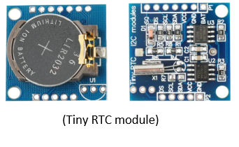

ー　工事中　（Under construction）ー

# MEZ68K8_RAM Rev2.1 for FUZIX 0.5

MEZ68K8_RAM Rev2.1は[EMUZ80](https://vintagechips.wordpress.com/2022/03/05/emuz80_reference/)ボード上で動く68008メザニンボードです。

（MEZ68K8_RAM Rev2.1メザニンボード）
 

EMUZ80はMicrochip社のPIC18F47Q43/83/84を使用して、Z80を制御するシングルボードコンピュータ
です。また、Z80の代わりにメザニンボードを装着することで、レガシーCPU（6502や、8088、V20、他）
を動かすことが出来ます。 
UART, SPI, I2C等の制御をPICで行い、レガシーCPUの外部I/Oとして機能を提供します。
SDカードはSPIを通して実装されています。 
PICから、レガシーCPUのメモリ空間にアクセスすることで、レガシーPCのプログラムをロードする
ことが出来るため、ROMは必要なくSRAMでプログラムを動作させることが出来ます。

（EMUZ80、MEZ68K8_RAM、RTCモジュール、SDカードモジュール）
 

MEZ68K8_RAM Rev2.1の[FUZIX](https://www.fuzix.org/)は、platform-[pico68k](https://hackaday.io/project/179200-68000-minimal-homebrew-computer)をベースにポーティングを行いました。

リアルタイムクロックは、platfoem-[68knano](https://github.com/74hc595/68k-nano)のds3234デバイスの実装を参考にしています。
# FUZIX起動画面
 

MEZ68K8_RAM Rev2.1では、FUZIX以外に、CP/M-68Kや68000用の[Universal Monitor](https://electrelic.com/electrelic/node/1317)をサポートしていますが、詳細については、[MEZ68K8_RAM(Rev1.3)](https://github.com/akih-san/MEZ68K8_RAM)を参照してください。

# [MEZ68K8_RAM(Rev1.3)](https://github.com/akih-san/MEZ68K8_RAM)からの追加変更点

１．IRQ, NMI割り込みのサポート 
２．RTC(DS1307)のサポート 
３．グルー・ロジック

## １．IRQ, NMI割り込みのサポート
Rev1.3では割り込みなく、最小限の機能を実現していました。Rev2.1では、オートベクターによるレベル５(IRQ)とレベル７(NMI)の割り込みをサポートします。 
10msインターバルのＩＲＱ割り込みを発生させています。UARTによるキー入力は、この割り込みでCPUに取り込まれ、バッファリングされます。 
CTRL-Qのキー入力でNMI割り込みが発生します。FUZIX動作時には、NMI割り込みでモニタ（Universal Monitor）が起動します。 
ただし、CP/M-68KはIRQ、NMI割り込みを使っていません。（Rev1.3相当のCP/M-68K） 
その他のプログラムではNMI割り込みの表示が出ますが、何もしないで元のプログラムに復帰します。 
 
## ２．RTC(DS1307)のサポート
I2Cを実装し、DS1307を使ったTiny RTC moduleをサポートします。 
Tiny RTC moduleはArduinoで使用可能で、[AliExpress](https://ja.aliexpress.com/?spm=a2g0o.home.logo.1.2fc55c72FX1lyE)から入手
することができます。また、安価な互換品が出回っています。テストでは互換品を使いましたが、特に問題なく使用できました。
SQピン端子は未使用です。SCL、SDA、VCC、GNDの４ピンを使用しています。

## ３．グルー・ロジック
SDカードアクセスの一部、割り込み、メモリアクセス関連の外部ロジックをCPLD（ATF16V8B）を使用して1chipにまとめてあります。
使用するために、jedファイルをATF16V8Bに書き込む必要があります。

# ファームウェアの書き込み
## 1. PIC18F47Q43/Q84/Q83
PICへの書き込みツールを用いて、ヘキサファイルを書き込みます。 
 
- PIC18F47Q43 - Q43Rev2.1.hex
- PIC18F47Q84 - Q84Rev2.1.hex
- PIC18F47Q83 - Q83Rev2.1.hex
 
＜注意点＞ 
EMUZ80ボードから、メザニンボード（MEZ68K8_RAM Rev2.1）を外した状態でPICへの書き込みを行います。
メザニンボードを装着しての書き込みは、かなりの高確率で失敗します。もしくは、PICに書き込めるライターを使用し、直接PICへ書き込みを行います。 
 
＜使用確認した書き込みツール＞ 
 
- snap(マイクロチップ社の書き込みツール) 

  - [snap](https://www.microchip.com/en-us/development-tool/PG164100)

 
- PICkit3（または互換ツール）  
  PICkitminus書き込みソフトを用いて、書き込むことが出来ます。以下で入手できます。 

  - [PICkitminus](http://kair.us/projects/pickitminus/)

## ２．CPLDへの書き込み

   CPLDには、ROMライタを使用してG16V8B/MEZ68K8_RAM2.1.jedファイルを書込みます。 
   使用したのは、XGecu Programmer Model TL866Ⅱ PLUSです。 
   少し古いですが、問題なく書き込みが出来ました。XGecu Official Siteは[こちら](https://xgecu.myshopify.com/) 

    
（今回使用したROMライタ）

## ３．μＳＤカードの作成
μSDカードはFAT32を使用しています。4G～16GBまでのＳＤカードで動作確認を行いました。DISKSフォルダ内の以下のフォルダとファイルを、FAT32でフォーマットされた
μSDカードにコピーします。 
 
　・CPMDISKS（CP/M-68K関連のフォルダ） 
　・OSDISKS	（FUZIX関連のフォルダ） 

　　（注意）フォルダ内に、圧縮されたDISK.zipファイルがあります。 
　　　　　　Gitのファイル容量制限でFUZIXのディスクイメージファイルを圧縮してあります。 
　　　　　　解凍したDISK.IMGファイルをコピーします。 

　・BASIC68K.BIN	（スタンドアロン版BASIC） 
　・UMON_68K.BIN	（ユニバーサルモニタ）

# 図面、部品表、PICピンアサイン、Gerberデータ
  - [図面](https://github.com/akih-san/FUZIX-for-MEZ68K8_RAM-Rev2.1/blob/main/pdf/MEZ68K8_RAM_R2.1%E5%9B%B3%E9%9D%A2.pdf)
  - [部品表](https://github.com/akih-san/FUZIX-for-MEZ68K8_RAM-Rev2.1/blob/main/pdf/MEZ68K8_RAM_R2.1%E9%83%A8%E5%93%81%E8%A1%A8.pdf)
  - [PICピンアサイン](https://github.com/akih-san/FUZIX-for-MEZ68K8_RAM-Rev2.1/blob/main/pdf/MEZ68K8_RAM%20v2.1%EF%BC%88PIC%E3%83%94%E3%83%B3%E3%82%A2%E3%82%B5%E3%82%A4%E3%83%B3%EF%BC%89.pdf)
  - [Gerberデータ](https://github.com/akih-san/FUZIX-for-MEZ68K8_RAM-Rev2.1/tree/main/MEZ68K8_RAM_R2.1_gerber)

# ソースコードからFUZIX 05をビルドする
[FUZIX](https://www.fuzix.org/)の移植はLinuxで行います。68000版の移植にはm68k-elf-gccが必要です。

# その他のツール
・FWのソースのコンパイルは、マイクロチップ社の 
 
　「MPLAB® X Integrated Development Environment (IDE)」 
 
　を使っています。（MPLAB X IDE v6.20）コンパイラは、XC8を使用しています。 
（https://www.microchip.com/en-us/tools-resources/develop/mplab-x-ide） 
 
・universal moniter 68000、及びEnhanced 68k BASICは、Macro Assembler AS V1.42を 
　使用してバイナリを作成しています。 
　ここから（http://john.ccac.rwth-aachen.de:8000/as） 入手できます。 
 
・FatFsはR0.15を使用しています。 
　＜FatFs - Generic FAT Filesystem Module＞ 
　http://elm-chan.org/fsw/ff/00index_e.html 
 

